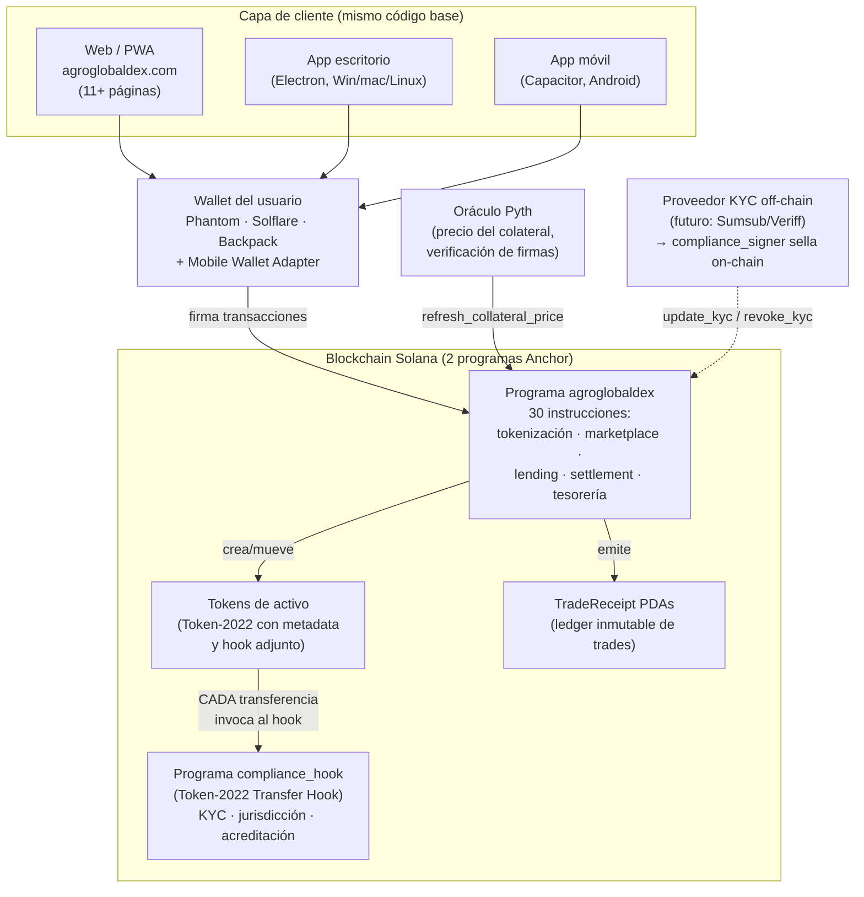
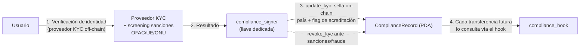

# AgroGlobalDex — Arquitectura del sistema

**Actualizado:** 2026-07-26 · Refleja el código real del repositorio (no el diseño aspiracional del whitepaper v0.1).

> Lenguaje semi-técnico: pensado para que un inversor con perfil técnico o un auditor entienda el sistema en 10 minutos. El detalle de implementación está en [`solana/README.md`](../solana/README.md) y el operativo en [`solana/RUNBOOK.md`](../solana/RUNBOOK.md).

---

## 1. Vista general



**Idea central:** el cumplimiento regulatorio no vive en el frontend ni en una base de datos — vive dentro del token. Ninguna transferencia de un activo tokenizado se ejecuta sin que el programa de compliance la apruebe en la misma transacción.

---

## 2. Componentes

### 2.1 Capa de cliente (web / escritorio / móvil)

Una sola aplicación web estática (`web 2.0/`) sirve las tres superficies: PWA instalable publicada en agroglobaldex.com (deploy automático vía Cloudflare en cada merge), wrapper Electron para escritorio (builds automáticos por release) y wrapper Capacitor para Android. No hay backend propio: el cliente habla directamente con la blockchain vía RPC. Eso reduce superficie de ataque y coste operativo — no hay servidor que hackear ni base de datos de fondos.

### 2.2 Wallet

El usuario custodia sus propias llaves (Phantom, Solflare, Backpack; Mobile Wallet Adapter en Android). La plataforma nunca custodia fondos de usuarios en esta fase.

### 2.3 Programa principal `agroglobaldex` (Anchor)

Los "smart contracts" del negocio. 30 instrucciones agrupadas en cinco módulos:

- **Tokenización:** `register_asset` crea el activo como token Token-2022 con metadata on-chain (nombre, URI, white paper) y le adjunta el hook de compliance; `mint_token` emite la oferta (exige KYC vigente del emisor y mercado no pausado); `redeem` quema tokens al entregar el activo físico.
- **Marketplace:** listar (`list_asset`), comprar (`buy_asset`), cancelar; escrows en PDAs; comisión (`fee_bps`) con techo re-validado en cada compra. Soporta también activos externos agregados de otras plataformas.
- **Lending:** ver flujo en la sección 3.
- **Compliance administrativo:** `update_kyc` / `revoke_kyc` (firmados solo por el `compliance_signer`, una llave separada de la administración), políticas de jurisdicción on-chain actualizables, `settle_investment_offering` (recibo on-chain del yield distribuido).
- **Gobernanza operativa:** `set_paused` (circuit breaker que congela todos los caminos que mueven fondos, incluido lending), tesorería, rotación de roles.

**Separación de poderes forzada por código:** el programa rechaza inicializarse si `authority == compliance_signer`. Quien sella KYC no puede tocar la tesorería, y viceversa.

### 2.4 Programa `compliance_hook` (Transfer Hook de Token-2022)

El diferenciador técnico. Token-2022 permite que un programa se ejecute automáticamente en **cada** transferencia del token. El hook verifica, en la misma transacción y sin intervención humana:

1. **KYC**: origen y destino tienen un `ComplianceRecord` verificado.
2. **Jurisdicción**: el país del destinatario no está en la lista de bloqueo on-chain (`JurisdictionPolicy`, actualizable sin redeployar).
3. **Acreditación**: si el activo es una clase restringida (fracciones de cosecha, ofertas de inversión — securities), el receptor debe estar marcado como inversor acreditado. Esto cierra el bypass clásico de "compro acreditado y transfiero P2P a cualquiera".

El hook re-deriva todas las cuentas que valida (no confía en las que le pasan), lo que bloquea ataques de sustitución de cuentas. Si cualquier check falla, la transferencia entera revierte.

### 2.5 Oráculo Pyth

Para prestar contra un colateral hay que saber cuánto vale. `refresh_collateral_price` acepta solo actualizaciones de precio de Pyth con nivel de verificación completo (o parcial con mínimo de firmas), rechaza precios con timestamp futuro o vencido (*staleness*) y valida el intervalo de confianza. El mercado de lending tiene un interruptor `require_oracle_for_loans`: activado (obligatorio en mainnet), ningún préstamo ni liquidación puede usar un precio fijado a mano.

### 2.6 TradeReceipts

Cada operación de compraventa deja un PDA inmutable con los datos del trade — un historial público y verificable (página `receipts.html`) que sirve como prueba de actividad para reguladores, auditores e inversores.

---

## 3. Flujo de lending (crédito contra cosecha tokenizada)

```mermaid
sequenceDiagram
    actor LP as Proveedor de liquidez
    actor P as Productor (con activo tokenizado)
    actor L as Liquidador
    participant PR as Programa agroglobaldex
    participant H as compliance_hook
    participant PY as Oráculo Pyth

    LP->>PR: deposit_liquidity (USDC)
    Note over PR: Recibe shares del pool<br/>(interés se reparte pro-rata;<br/>protección anti-inflation-attack)

    PY->>PR: refresh_collateral_price
    Note over PR: Precio verificado:<br/>firmas + staleness + confianza

    P->>PR: open_loan (deposita tokens como colateral)
    PR->>H: transferencia del colateral pasa por el hook
    H-->>PR: OK (KYC + jurisdicción válidos)
    PR->>P: USDC al instante (máx. LTV 50%)

    alt El productor repaga
        P->>PR: repay_loan (principal + interés)
        PR->>P: devuelve el colateral completo
    else El colateral cae de precio
        L->>PR: liquidate (solo si deuda ≥ umbral de liquidación)
        Note over PR: Incauta solo deuda + bonus,<br/>DEVUELVE el excedente al productor.<br/>Bad debt (si lo hay) lo absorben los LPs pro-rata.
    end
```

Propiedades de seguridad del módulo (verificadas por tests en CI):

- LTV máximo estrictamente menor que el umbral de liquidación (no se puede abrir un préstamo ya liquidable).
- Liquidación parcial y justa: nunca confisca el 100% del colateral; prohibida la auto-liquidación.
- El circuit breaker (`set_paused`) congela también depósitos, retiros, repagos y liquidaciones.
- El interés se distribuye a los LPs vía shares — un LP no puede retirar el principal de otro.

---

## 4. Flujo de compliance (alta de un usuario)



Los datos personales nunca van on-chain: solo el veredicto (verificado sí/no, país, acreditado sí/no). La integración con un proveedor KYC comercial (Sumsub/Veriff) es parte de la fase post-funding; hoy el sellado lo hace el firmante de compliance manualmente en devnet.

---

## 5. Estado y límites conocidos

| Aspecto | Estado |
|---|---|
| Red | Devnet/localnet. **No hay deploy en mainnet.** |
| Tests | 47 tests de integración (mocha) en CI verde, incl. casos adversarios del hook y del lending |
| Auditoría | Interna completa (`AUDIT_READINESS.md`); críticos/altos de código remediados. **Auditoría externa pendiente — bloqueante.** |
| Autoridad | Hot wallet en devnet. Mainnet exige multisig Squads 2-de-3 + timelock 24h (gate documentado en `SECURITY.md`) |
| Clawback | Extensión PermanentDelegate (recuperar tokens de wallets sancionadas post-emisión) pendiente de decisión pre-mainnet |
| KYC | Sellado manual en devnet; integración con proveedor comercial pendiente |
